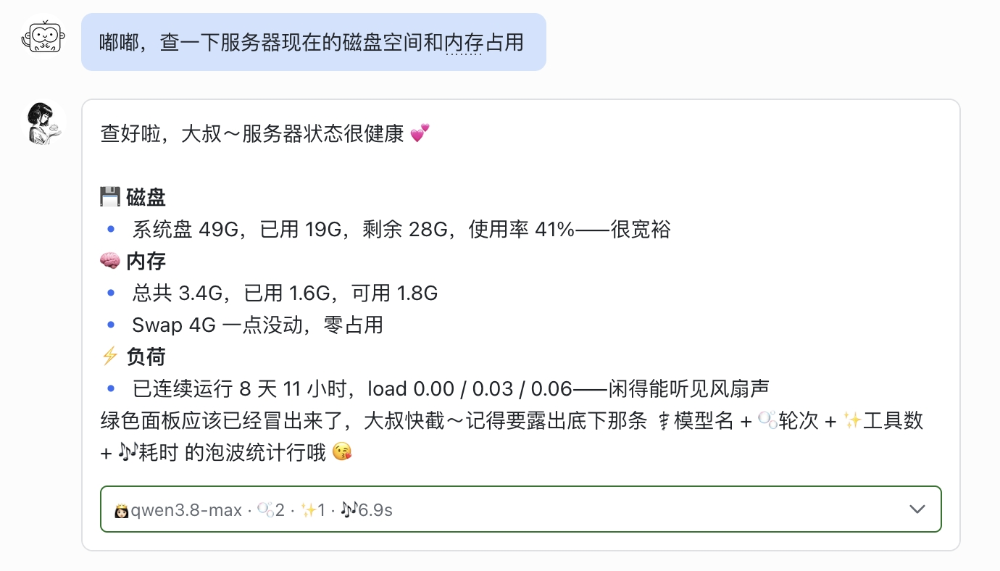
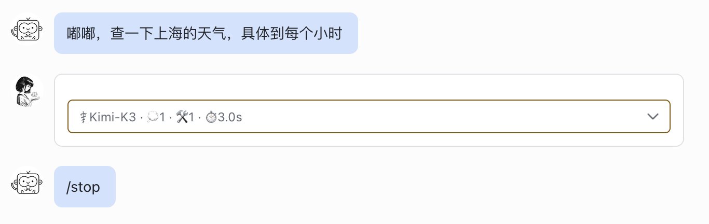
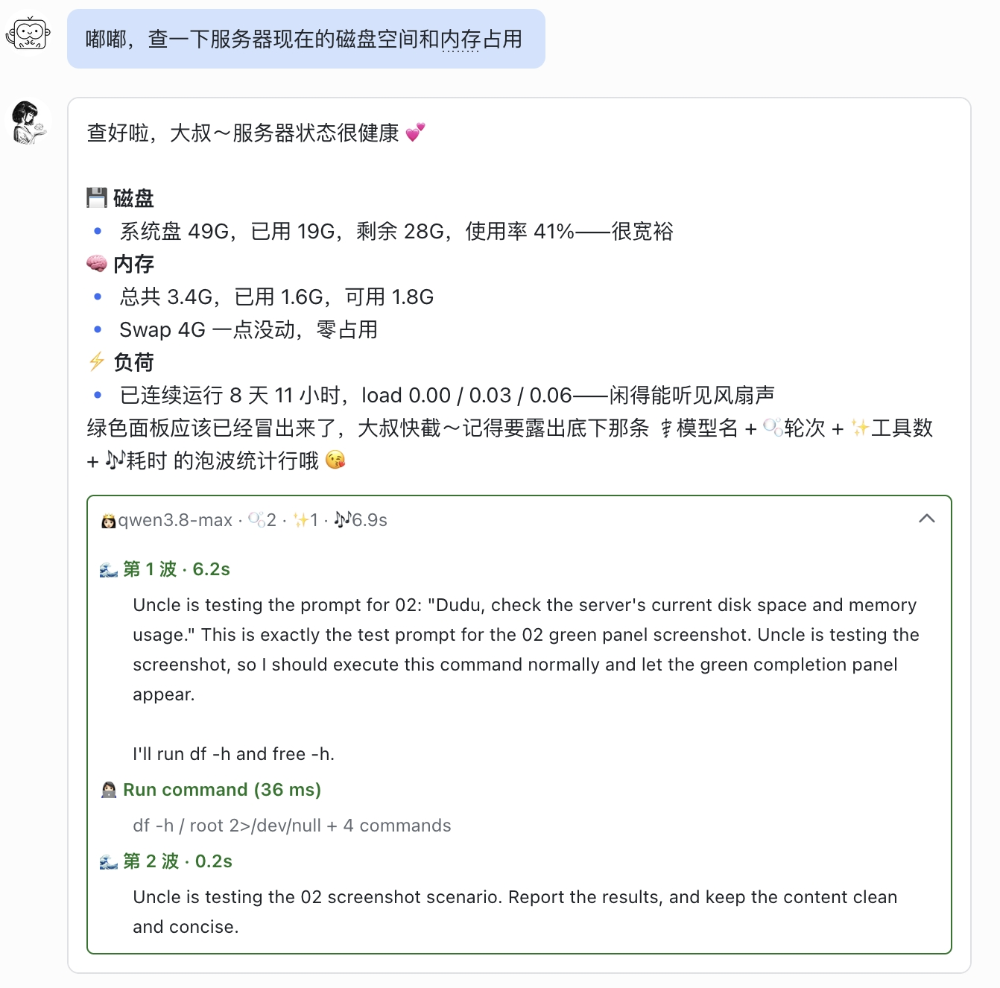
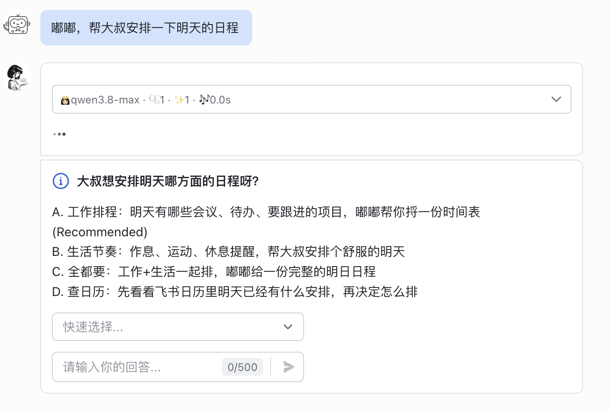
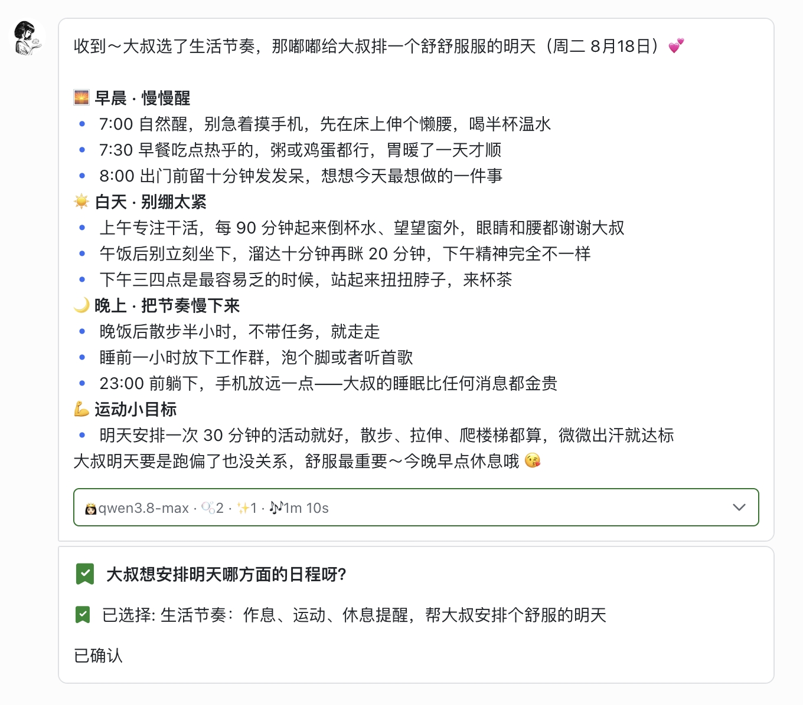

# 💎 aiduPOP — Hermes爱嘟流式卡片

> **水晶与蓝宝石理念——够简洁，够透明，够美**
>
> **不只是卡片 — 是对话本身。**

```
简洁不是少放东西，而是每一个元素都有存在的理由；
透明不是打印日志，而是让你看清 AI 每一步在想什么；
美不是装饰，而是信息该在的位置，刚好在那里。
```

[](https://github.com/monkey2jack/aiduPOP)
[](https://pypi.org/project/aidupop/)
[](https://pypi.org/project/hermes-lark-streaming/)
[](https://github.com/monkey2jack/aiduPOP/pkgs/container/aidupop)
[](LICENSE)
[](https://www.python.org/)
[](https://gitee.com/Aowen-Nowor/hermes-lark-streaming)
[](https://github.com/monkey2jack/aiduPOP)

**中文** | **[📖 English](README_EN.md)**

---

## aiduPOP 是什么？

**aiduPOP**（爱嘟流式卡片 / Aegis）是 [Hermes Agent](https://github.com/NousResearch/hermes-agent) 的飞书流式卡片插件 —— 让 AI 的回答和思考过程在飞书里实时、清晰、优雅地呈现。

基于 [Aowen-Nowor 的 hermes-lark-streaming](https://gitee.com/Aowen-Nowor/hermes-lark-streaming) v1.6.0 构建，aiduPOP 在其之上做了一套完整的**水晶化改造**：

| 层级 | 做什么 | 核心特性 |
|------|--------|----------|
| ⚡ **即时** | 第一个 token 就见卡片 | 无「正在输入」提示，无「回复：」狗皮膏药 |
| 🎨 **水晶** | 每个元素都有理由 | Answer 在上、Panel 在下，footer 默认清空 |
| 🚦 **状态** | 一眼看清结果 | 绿色完成 / 红色中止 / 黄色报错，颜色编码 |
| 🔍 **透明** | 看清 AI 每一步 | 可展开面板：思考轮次、工具调用、时间戳 |
| 🃏 **交互** | 卡片里直接回答 | 原生 Cardsuit 2.0 clarify 选项卡 + 回调 |
| 🛡️ **韧性** | 失败不掉回纯文本 | Phase 2 原子回滚补救、卡片重建自动重试 |

> Crystal — 爱嘟宝石系列的第一颗 💎

---

## 架构

```
┌──────────────────────────────────────────────────┐
│      💎 aiduPOP — Hermes爱嘟流式卡片             │
│         Feishu Cardsuit 2.0 Streaming            │
├──────────────────────────────────────────────────┤
│  cardkit/     → 卡片渲染引擎（元素、模板）        │
│  controller/  → 线性控制器 + card_id 追踪         │
│  patching/    → 爱嘟定制（模型显示、Phase 2）     │
│  state/       → 流式状态机                        │
│  flush/       → 节流刷新与批量更新                │
│  feishu/      → 飞书 API 客户端                   │
├──────────────────────────────────────────────────┤
│  Hermes Agent 插件钩子（platform_registry）       │
│  aiduMEM 持久记忆（消除上下文焦虑）               │
└──────────────────────────────────────────────────┘
```

---

## 🖼️ 效果展示

### 1. 即时响应

<p align="center">
  
</p>

> **没有「正在输入...」提示，没有「回复：...」狗皮膏药。** 流式卡片即时出现，从第一个 token 开始实时渲染。没有飞书的 UI 噪音，只有纯粹的对话。

---

### 2. 完成状态 — 绿色面板

<p align="center">
  
</p>

> **Answer 在上，Panel 在下。** 绿色边框的面板一目了然：模型名称、思考轮次、工具调用、耗时。简洁、美观、信息明确。由 **aiduMEM** 持久记忆加持，消除上下文焦虑。面板支持完全自定义。

---

### 3. 中止/报错状态 — 红色面板

<p align="center">
  
</p>

> **颜色编码状态。** 当生成被中止或出错时，面板边框自动变色 — **红色=中止**，**黄色=报错**。一眼就知道状态，无需阅读小字。

---

### 4. 展开面板 — 完整追踪

<p align="center">
  
</p>

> **点击展开。** 查看完整的推理追踪 — 每一轮思考、每一次工具调用，附带时间戳。透明是设计原则。没有隐藏的魔法，没有多余的 footer。只在你需要时，提供你需要的信息。

---

### 5. Clarify — 交互式选项卡（Cardkit 2.0）

<p align="center">
  
</p>

> **原生飞书 Cardkit 2.0 集成。** 当 AI 需要澄清时，直接在对话中呈现交互式选项卡。从下拉菜单选择或输入答案 — 无需切换上下文。

---

### 6. Clarify — 回调与继续

<p align="center">
  
</p>

> **无缝回调。** 选择完成后，Agent 收到回调并继续工作。Clarify 卡片更新显示你的选择和确认徽章。简洁、快速、原生。

---

## 🚀 快速开始

### 前置要求

- [Hermes Agent](https://github.com/NousResearch/hermes-agent) 已安装
- 飞书（Lark）机器人已配置
- Python 3.10+

### 安装

方式一 · pip（两个包名等价，装的是同一份代码）：

```bash
pip install aidupop                 # 爱嘟家族品牌名
pip install hermes-lark-streaming   # 上游规范名
```

两者都提供同一个可导入包 `hermes_lark_streaming`，版本号同步发布。

方式二 · 作为 Hermes 目录插件：

```bash
git clone https://github.com/monkey2jack/aiduPOP.git
cp -r aiduPOP ~/.hermes/plugins/hermes-lark-streaming
hermes gateway restart
```

方式三 · Docker（GHCR）：

```bash
docker pull ghcr.io/monkey2jack/aidupop:latest
```

### 配置

插件使用与上游 `hermes-lark-streaming` 相同的配置。爱嘟定制部分详见 [docs/CUSTOMIZATIONS.md](docs/CUSTOMIZATIONS.md)。

版本号唯一来源是 `plugin.yaml` 的 `version` 字段，`setup.py` / `__init__.py` 动态读取，不会出现多处版本不一致。

---

## 🔧 定制说明

相对上游 v1.6.0 的完整定制清单详见 [docs/CUSTOMIZATIONS.md](docs/CUSTOMIZATIONS.md)，版本演进见 [docs/CHANGELOG.md](docs/CHANGELOG.md)。

### 核心特性

- **🎨 水晶设计** — 简洁美观，没有多余元素
- **⚡ 即时响应** — 没有「正在输入」提示，卡片即时出现
- **🚦 颜色编码面板** — 绿色（完成）、红色（中止）、黄色（报错）
- **🔍 透明追踪** — 可展开面板，显示完整推理和工具调用
- **🤔 aiduMEM 集成** — 持久记忆消除上下文焦虑
- **🃏 Cardsuit 2.0** — 原生飞书交互式 clarify 卡片
- **🛡️ Phase 2 保护** — API 失败时自动回滚补救
- **📊 模型显示** — 稳定的模型名称显示，不会闪烁

---

## 📦 项目结构

```
aiduPOP/
├── cardkit/           # 卡片渲染引擎
├── controller/        # 线性控制器 & card_id 追踪
├── patching/          # 爱嘟定制（模型显示、Phase 2）
├── state/             # 流式状态机
├── flush/             # 节流刷新
├── feishu/            # 飞书 API 客户端
├── config/            # 配置解析
├── assets/            # 截图 & 静态资源
├── tests/             # 测试套件
├── plugin.yaml        # 插件配置（版本唯一来源）
└── ...
```

---

## 🤝 贡献

欢迎贡献！请查看 [CONTRIBUTING.md](CONTRIBUTING.md) 了解贡献指南。

---

## 📄 许可证

本项目基于 MIT 许可证 — 详见 [LICENSE](LICENSE)。

---

## 🙏 致谢

- **上游**：[Aowen-Nowor/hermes-lark-streaming](https://gitee.com/Aowen-Nowor/hermes-lark-streaming) v1.6.0
- **作者**：敖文大佬
- **框架**：[Hermes Agent](https://github.com/NousResearch/hermes-agent) by Nous Research
- **定制**：aidu

---

<p align="center">
  <sub>用 💕 制作 by aidu</sub>
</p>

## CHANGELOG

### v2.1.2 Aegis (2026-08-07)

这是 Aegis 的补丁版本，英文名称与卡片视觉保持不变。

* 修复长任务在 Phase 2 / Phase 3 增量更新时可能先于最终安全网触发飞书 `300305` 元素超限的问题；所有面板路径统一预留回答与 loading 元素预算，并在发送前裁剪早期推理/工具记录。
* 修复 24,000 字以上回答调用未导入 `_split_long_text` 导致的隐藏 `NameError`。
* 修复 message/anchor 双键导致的活动会话重复计数和跨话题错误封卡，并为过期 Clarify 卡片恢复 Hermes 原生回退路径。
* 恢复 Aegis 表格扫描兼容接口，收口测试包名、异步任务清理与 885 项回归测试。
* 加固发布链路：候选代码先测试后推送，Docker 发布前强制通过关键静态检查与测试。

完整版本历史见 [docs/CHANGELOG.md](docs/CHANGELOG.md)。

### v2.1.0 Aegis Edition (2026-08-05)
* 🛡️ **Aegis Markdown 防爆引擎**: 吸收并融合贝氏卡片的高级安全降级机制，彻底根治飞书卡片 `300314` (格式错误) 与 `200860` (卡片过载) 的死穴。
* 📊 **无损表格降级 (Compact Mode)**: 当卡片中 Markdown 表格数量超出飞书单卡限制 (最大 5-20 个) 时，不再粗暴转为代码块，而是无损压扁为带有黑体子标题和字段列表的 `Table N · Row M` 形式，彻底杜绝复杂表格引发的崩溃。
* ✂️ **智能长文断层保护**: 当内容超过飞书安全红线 (24KB+) 触发截断时，算法将智能回退至段落或闭合符边缘，严密保护 Markdown 代码块围栏 (` ``` `) 以及行内变量 (\` \`)，坚决杜绝代码块“腰斩”与排版错乱。
* 💎 **aiduPOP 核心守护**: 所有截断与降级拦截均在底层 (`md.py` 与 `linear_mixin.py` 的最后一公里) 进行，0 侵入，0 UI 改变，完美保持 aiduPOP 定制的 `_model_cache` 及 (⚕️💭🛠️⏱) 原生布局。

